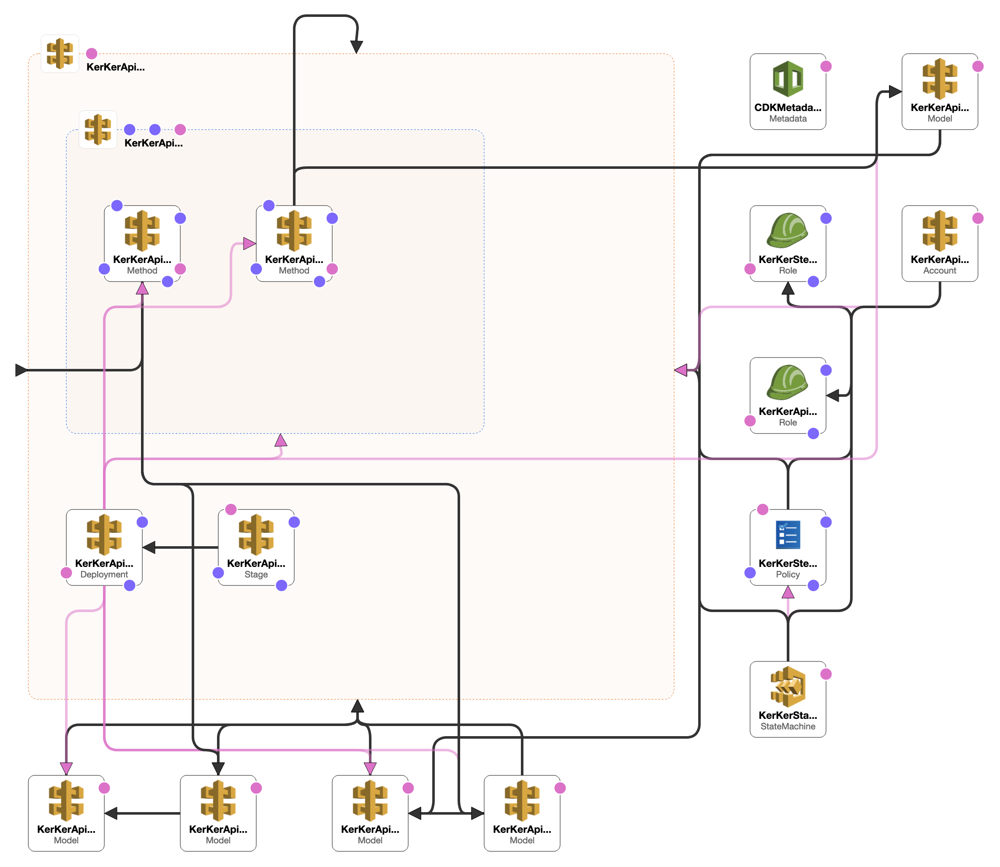

# projen-simple  
Build a custom construct based on an example in an AWS Blog post and use [projen](https://github.com/projen/projen) to publish to 4 language repositories.   
(Hope Go is coming soon)  

# Architecture  
This library constrcution is referred to the first example in this AWS blog, [*Introducing Amazon API Gateway service integration for AWS Step Functions*](https://aws.amazon.com/tw/blogs/compute/introducing-amazon-api-gateway-service-integration-for-aws-step-functions/) written by Benjanmin Smith. After you deploy the stack with whatever programming language you like, i.e., Typescript, Python, Java, or C sharp, you'll get a view similar to the following diagram:  
  

# How to utilize polyglot packages and deploy     
## TypeScript
   ```bash
   $ cdk --init language typescript
   $ yarn add projen-statemachine-example
   ``` 
   ```typescript
   import { StateMachineApiGatewayExample } from 'projen-statemachine-example';

    export class TypescriptStack extends cdk.Stack {
    constructor(scope: cdk.Construct, id: string, props?: cdk.StackProps) {
        super(scope, id, props);

        const stageName = 'default';
        const partPath = 'pets';
        const exampleConstruct = new StateMachineApiGatewayExample(this, 'KerKer', {
            stageName: stageName, partPath: partPath});

        new cdk.CfnOutput(this, 'OStateMachine', {
            value: exampleConstruct.stateMachine.stateMachineArn});
        new cdk.CfnOutput(this, 'OExecutionOutput', {
            value: exampleConstruct.executionInput, description: 'Sample input to StartExecution.'});
    }
   ```
## Python  
   ```bash
   $ cdk init --language python
   $ cat <<EOL > requirements.txt
aws-cdk.core
scotthsieh_projen_statemachine
EOL
   $ python -m pip install -r requirements.txt
   ```
   ```python
   from aws_cdk import core as cdk
   from scotthsieh_projen_statemachine import StateMachineApiGatewayExample

   class PythonStack(cdk.Stack):
       def __init__(self, scope: cdk.Construct, construct_id: str, **kwargs) -> None:
            super().__init__(scope, construct_id, **kwargs)
            
            stage_name = 'default'
            part_path = 'pets'
            example_construct = StateMachineApiGatewayExample(
                self, 'PythonStatemachne', stage_name=stage_name, part_path=part_path,
            )

            cdk.CfnOutput(self, "OStateMachine",
                value=example_construct.state_machine.state_machine_arn
            )
            cdk.CfnOutput(self, "OExecutionOutput", value=example_construct.execution_input, description="Sample input to StartExecution.")
   ```
## Java  
   ```bash
   $ cdk init --language java
   $ mvn package
   ```
   ```xml
   .
   .
   <properties>
        <project.build.sourceEncoding>UTF-8</project.build.sourceEncoding>
        <custom.construct.version>0.1.20</custom.construct.version>
        <cdk.version>1.104.0</cdk.version>
        <junit.version>5.7.1</junit.version>
    </properties>
    .
    .
    <dependencies>
        <!-- AWS Cloud Development Kit -->
        .
        .
        .
        <dependency>
            <groupId>io.github.hsiehshujeng</groupId>
            <artifactId>projen-statemachine</artifactId>
            <version>${custom.construct.version}</version>
        </dependency>
        .
        .
        .
    </dependencies>
   ```
   ```java
   package com.myorg;

   import software.amazon.awscdk.core.Construct;
   import software.amazon.awscdk.core.CfnOutput;
   import software.amazon.awscdk.core.CfnOutputProps;
   import software.amazon.awscdk.core.Stack;
   import software.amazon.awscdk.core.StackProps;
   import io.github.hsiehshujeng.projen.statemachine.*;
   
   public class JavaStack extends Stack {
       public JavaStack(final Construct scope, final String id) {
           this(scope, id, null);
        }

        public JavaStack(final Construct scope, final String id, final StackProps props) {
            super(scope, id, props);
            
            String stageName = "default";
            String partPath = "pets";
            StateMachineApiGatewayExample exampleConstruct = new StateMachineApiGatewayExample(this, "KerKer",
                StateMachineApiGatewayExampleProps.builder().stageName(stageName).partPath(partPath).build());

            new CfnOutput(this, "OStateMachine",
                CfnOutputProps.builder()
                    .value(exampleConstruct.getStateMachine().getStateMachineArn()).build());
            new CfnOutput(this, "OExecutionOutput", CfnOutputProps.builder()
                .value(exampleConstruct.getExecutionInput())
                .description("Sample input to StartExecution.").build());
        }
    }
   ```
## C#
    ```bash
    $ cdk init --language csharp
    $ dotnet add src/Csharp package Projen.Statemachine --version 0.1.21
    ```
    ```cs
    using Amazon.CDK;
    using ScottHsieh.Examples;

    namespace Csharp
    {
        public class CsharpStack : Stack
        {
            internal CsharpStack(Construct scope, string id, IStackProps props = null) : base(scope, id, props)
            {
                string stageName = "default";
                string partPath = "pets";

                var exampleConstruct = new StateMachineApiGatewayExample(this, "KerKer", new StateMachineApiGatewayExampleProps
                {
                    StageName = stageName,
                    PartPath = partPath
                });

                new CfnOutput(this, "OStateMachine", new CfnOutputProps
                {
                    Value = exampleConstruct.StateMachine.StateMachineArn
                });
                new CfnOutput(this, "OExecutionOutput", new CfnOutputProps
                {
                    Value = exampleConstruct.ExecutionInput,
                    Description = "Sample input to StartExecution."
                });
            }
        }
    }
    ```

# References  
* [jsii reference](https://github.com/cdklabs/jsii-release)  
* [aws-cdk-go](https://github.com/aws/aws-cdk-go)  
* [jsii](https://github.com/aws/jsii)  