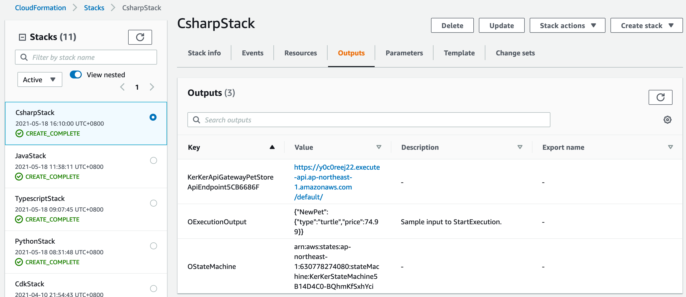

# How a successful deployment looks like  
  
## Deployment reference  
```bash
$ cdk init --language csharp
$ dotnet add src/Csharp package Projen.Statemachine --version 0.1.21
```
```cs
using Amazon.CDK;
using ScottHsieh.Examples;

namespace Csharp
{
    public class CsharpStack : Stack
    {
        internal CsharpStack(Construct scope, string id, IStackProps props = null) : base(scope, id, props)
        {
            string stageName = "default";
            string partPath = "pets";

            var exampleConstruct = new StateMachineApiGatewayExample(this, "KerKer", new StateMachineApiGatewayExampleProps
            {
                StageName = stageName,
                PartPath = partPath
            });

            new CfnOutput(this, "OStateMachine", new CfnOutputProps
            {
                Value = exampleConstruct.StateMachine.StateMachineArn
            });
            new CfnOutput(this, "OExecutionOutput", new CfnOutputProps
            {
                Value = exampleConstruct.ExecutionInput,
                Description = "Sample input to StartExecution."
            });
        }
    }
}
```
# Welcome to your CDK C# project!

This is a blank project for C# development with CDK.

The `cdk.json` file tells the CDK Toolkit how to execute your app.

It uses the [.NET Core CLI](https://docs.microsoft.com/dotnet/articles/core/) to compile and execute your project.

## Useful commands

* `dotnet build src` compile this app
* `cdk deploy`       deploy this stack to your default AWS account/region
* `cdk diff`         compare deployed stack with current state
* `cdk synth`        emits the synthesized CloudFormation template