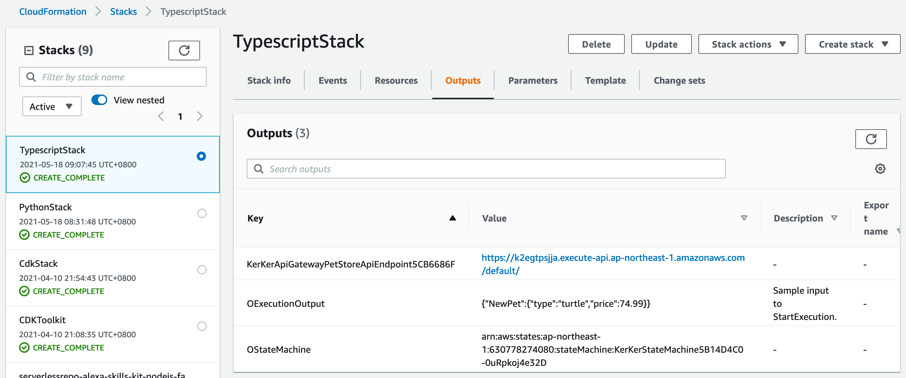

# How a successful deployment looks like  
  
## Deployment Reference  
```bash
$ cdk --init language typescript
$ yarn add projen-statemachine-example
``` 
```typescript
import { StateMachineApiGatewayExample } from 'projen-statemachine-example';

export class TypescriptStack extends cdk.Stack {
constructor(scope: cdk.Construct, id: string, props?: cdk.StackProps) {
    super(scope, id, props);

    const stageName = 'default';
    const partPath = 'pets';
    const exampleConstruct = new StateMachineApiGatewayExample(this, 'KerKer', {
        stageName: stageName, partPath: partPath});

    new cdk.CfnOutput(this, 'OStateMachine', {
        value: exampleConstruct.stateMachine.stateMachineArn});
    new cdk.CfnOutput(this, 'OExecutionOutput', {
        value: exampleConstruct.executionInput, description: 'Sample input to StartExecution.'});
}
```

If you want to deploy the stack directly after cloning this repository, refer to the following commands.  
```bash
$ cd ${projen_root}
$ pj build
$ cdk --app lib/demo/typescript/typescript-stack.js deploy --profile scott.hsieh
```